# HCI 设计作业

>校园助理设计

  

--------

## 1. 角色设定

iCampus面向广大学生、教师、管理员群体

||学生|教师|管理员|
|:--:|:--:|:--:|:--:|
|||||
|名字|张三|马云|孙悟空|
|生活|校园生活占据了张三生活的全部，每周都有大量课程，会收到大量通知和消息。周末往返于各个校区上辅修课程，并且热爱学习，常常需要借阅图书或预约自习室。|有不少授课任务，有考查课常常需要布置作业，会收到大量通知和消息。平日常常往返于各个校区授课。有科研任务，常常需要查阅图书。|负责学校日常信息的维护和公告, 属于后勤或者信息部门。这是他的工作。|
|需求|一款简单好用的校园辅助APP来帮助他记录每天的课程和通知消息，需要方便地联系校内同学和老师，需要快速便捷地进行一卡通操作、图书馆操作和班车预约等。|一款简单好用的校园辅助APP来帮助他记录每天的课程和通知消息，需要方便地发生课程通知给同学们，需要能够快速联系校内同学和老师，需要快速便捷地进行一卡通操作、图书馆操作和班车预约等。|一款简单好用的校园辅助APP来帮助他发生学校和学院的通知消息，需要能够快速联系校内同学和老师，需要快速便捷地进行一卡通操作、图书馆操作和班车预约等。|

## 2. 内容分析

### 2.1 场景描述与需求分析

#### 学生核心需求：
查看课表，学生选课，获取信息、课程通知，联系其他人。

#### 教师核心需求：
查看教师日程，获取信息，联系其他人，发送课程通知。

#### 管理员核心需求
发布学校和学院信息、通知一些情况，联系其他人。

### 2.2 明确预期效果

#### 2.2.1 可实现功能

##### 学生

查看课表，查看课程消息，接受查看学院消息，联系其他学生、联系课程教师，支付水电费、一卡通的充值、挂失、注销、补办，校车预定，图书馆查询、自习室预约。

##### 教师

查看教师课表、查看学生名单，获取学校信息、学院信息，与学生、课程教师交流，发送课程通知，一卡通的充值、挂失、注销、补办。校车预定，图书馆查询。

##### 管理员

发布学校和学院信息，通知一些情况，与学生、教师交流，校车预定，图书馆查询。

#### 2.2.2 展示内容

##### 课程页面

分为课程和考试两个子页面。课程页面依据星期和日期，以条目的形式展示每日课程，同时点击屏幕上方可以选择学期。考试子页面展示即将到来的考试。教师的课表为安排的授课时间，可点开课程查看学生列表，并发送全员消息，考试为自己负责的考试。

##### 消息页面

分为通知和私信，通知展示来自具体某门课程或者学院、学校的消息，类似微信公众号的推送，所有来源的通知展示在一个页面上，而私信展示来自学生或者老师的消息，类似QQ和微信，一个联系人为一个会话。

##### 应用页面

展示其它全部功能，包含在五个子模块里，分别为一卡通、图书馆、校车、水电费、学校新闻。点击后展示相应功能。

##### 个人信息页面

展示个人信息，和应用设置等内容。个人信息包括背景图片、头像、姓名、学号、年级、学院、专业和联系方式，iCampus账号、微信、QQ、邮箱、手机号码等。

##### 侧边栏

在每个页面点击左上角三横条，可调出侧边栏，简单展示头像姓名和使用时间，并可以切换四个主页面。

## 3. 功能生成

#### 学生

查看课表——选择“课程”页面，展示在主页的即为课表。

查看课程消息——选择“消息”页面，在“通知”子页面中，查看课程消息。

接受查看学院、学校消息——选择“消息”页面，在通知子页面中，查看学院学校信息。

联系其他学生、联系课程教师——选择“消息”页面，点击右上角的三个点，进入联系人页面选择已保存联系人或搜索全校师生。

支付水电费——选择“应用”页面，选择“水电费”，进入后查询自己寝室并缴费。

一卡通的充值、挂失、注销、补办——选择“应用”页面，选择“一卡通”，选择“充值”、“挂失”、“注销”、“补办”。

校车预定——选择“校车”页面，查询校车班次后进行预约。

图书馆查询、自习室预约——选择“图书馆”页面，选择“图书查询”或“自习室预约”。

#### 教师

查看教师课表——选择“课程”页面，展示在主页的即为课表。

查看学生名单——选择“课程”页面，点击具体某门课程后显示学生名单。

获取学校信息、学院信息——选择“消息”页面，选择“通知”，查看学校和学院消息。

与学生、课程教师交流——选择“消息”页面，点击右上角的三个点，进入联系人页面选择已保存联系人或搜索全校师生。

发送课程通知——选择“课程”页面，点击具体某门课程后显示学生名单。

一卡通的充值、挂失、注销、补办——选择“应用”页面，选择“一卡通”，选择“充值”、“挂失”、“注销”、“补办”。

校车预定——选择“校车”页面，查询校车班次后进行预约。

图书馆查询——选择“图书馆”页面，选择“图书查询”。

#### 管理员

发生学校和学院信息——进入后台编辑页面，发布相应的信息条目。
与学生、教师交流——选择“消息”页面，点击右上角的三个点，进入联系人页面选择已保存联系人或搜索全校师生。
校车预定——选择“校车”页面，查询校车班次后进行预约。
图书馆查询——选择“图书馆”页面，选择“图书查询”。
关键任务场景
查看课表（学生）——开学不久，同学们还记不住上课时间，因此每次都要打开相册进行查找，很不方便，他们迫切想要一个方便的软件，能够打开立即展示今天的课程。
接受查看学院、学校消息（学生、教师）——学校校园网维护暂时只能通过局域网访问，学生和老师都需要尽快知道这个消息。
联系其他学生、教师（学生、教师）——有重要的事情需要询问其他人，但是没有微信联系方式，需要通过搜索校内所有人来联系。
发送课程通知（教师）——下节课做实验但是老师忘记通知了，需要方便地通知所有学生。
电费缴费（学生）——同学们正在熬夜复习明天的考试，而寝室突然断电了，需要有快速充电费的方式，放在连接学校服务器的应用上是最快、最方便的。

#### 卡片用例模型

##### 查看课表

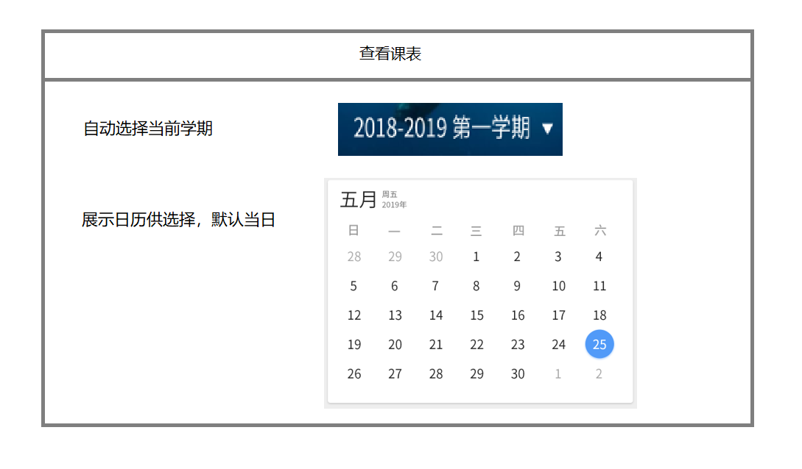
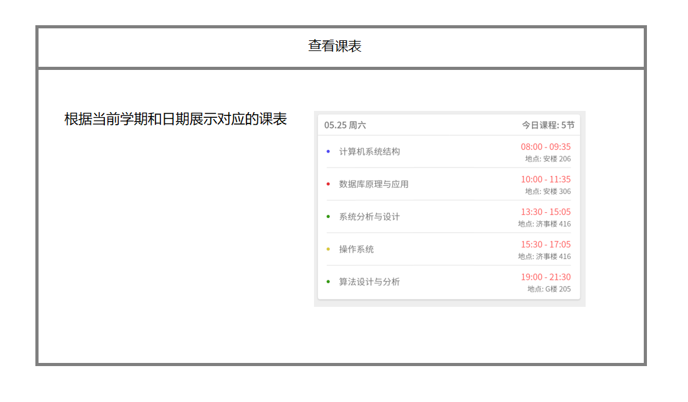
 
##### 电费缴费
 
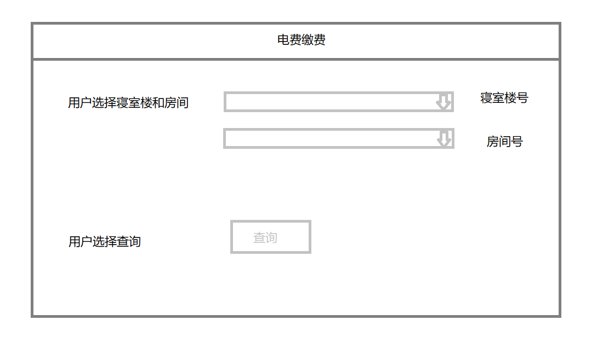
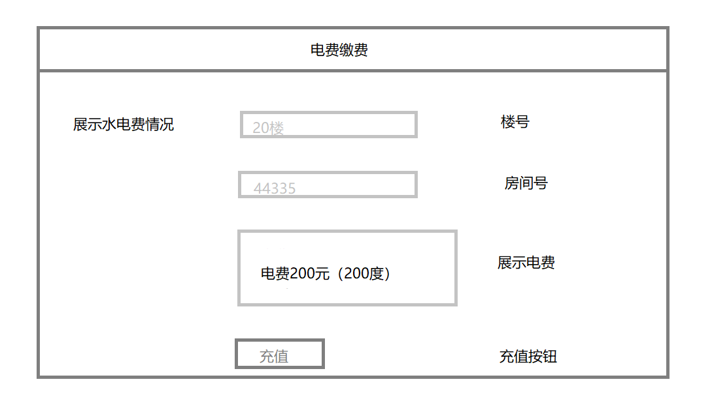
  
##### 发送课程通知
 
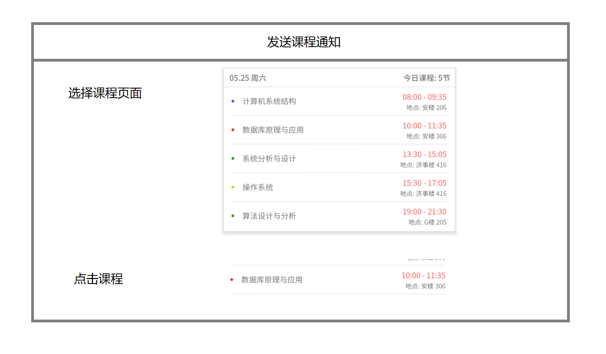
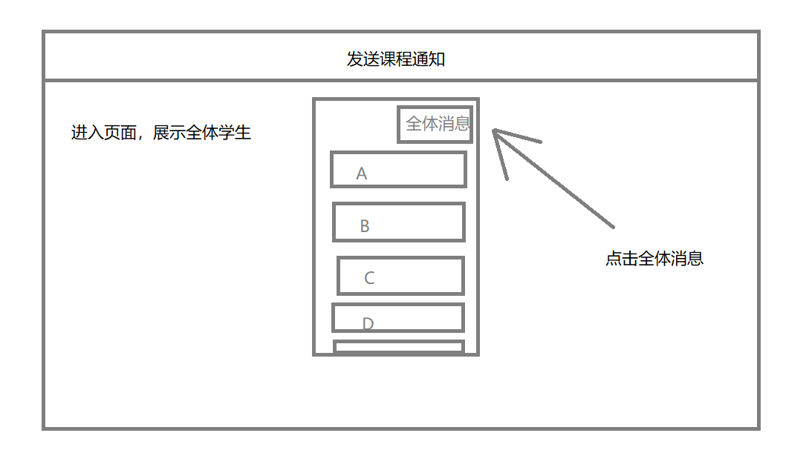
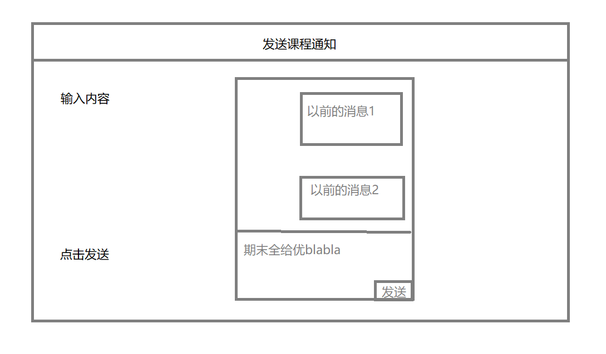
 
##### 接收学院学校信息
 
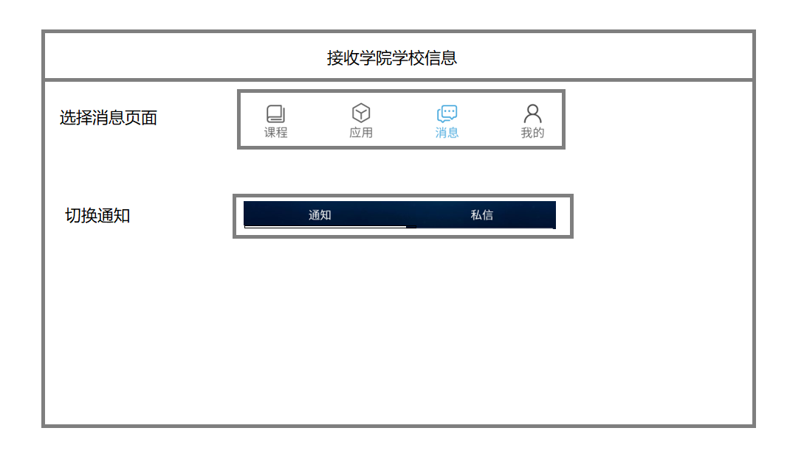
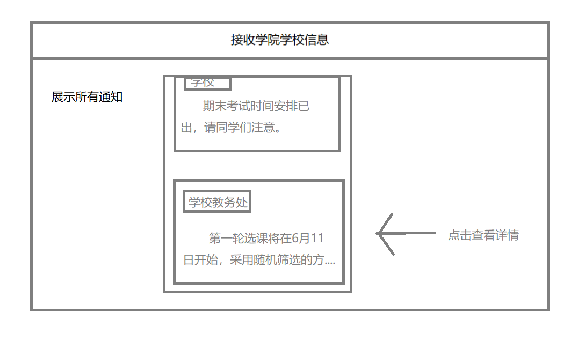
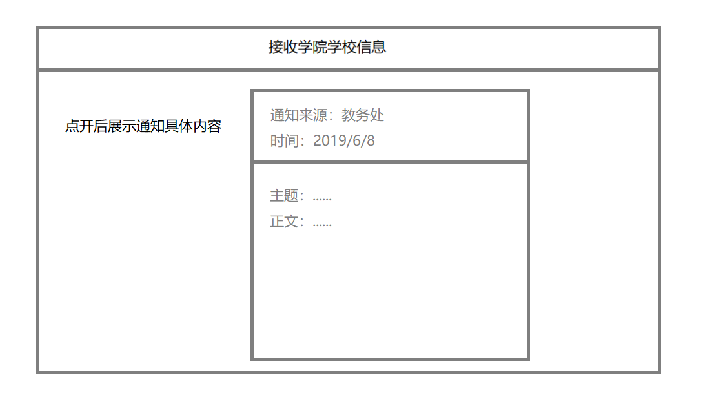
 
##### 联系其他学生, 教师
 
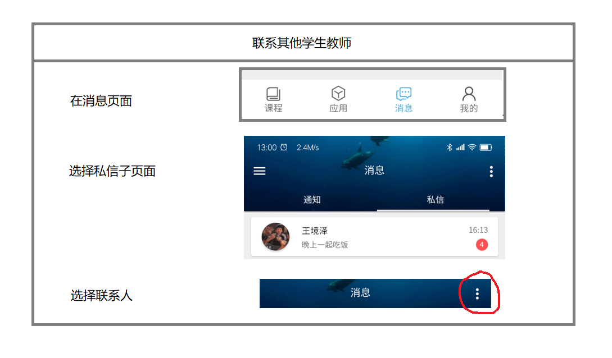
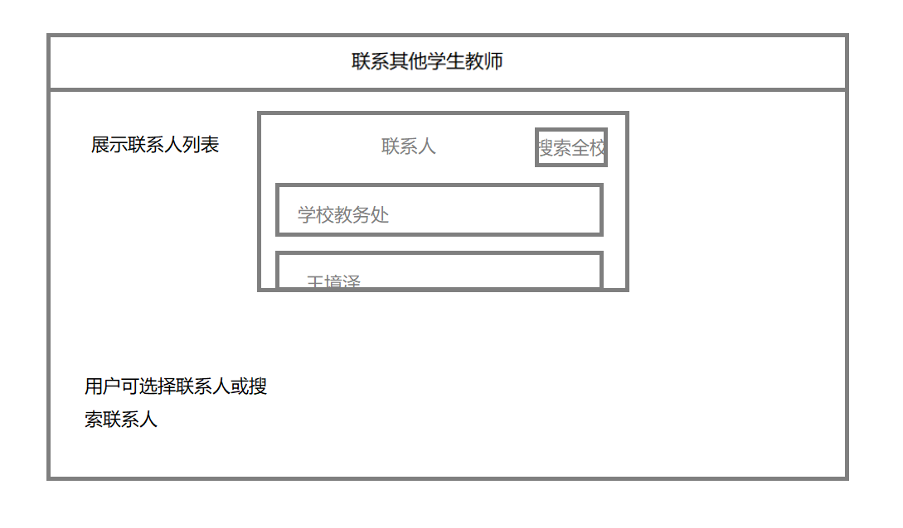
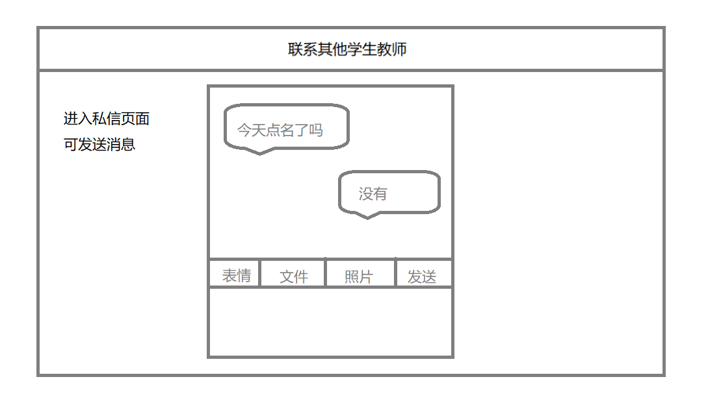
 
## 4. 策划

#### 系统的操作环境

安卓和IOS系统

#### 风格设计

使用简单风格，常见的切换页面的方式符合许多人的使用习惯。顶栏和底栏图标风格使用简洁的黑白圆角图标，应用页使用具体明确的图标。卡片和展示条全部使用柔和的阴影来过渡。布局为四个主页面，进入主页面后分为必要的子页面，较为清楚且切换方便。配色使用白色和蓝色，富有理性色彩。

#### 原型界面生成

##### 页面逻辑

##### 课程

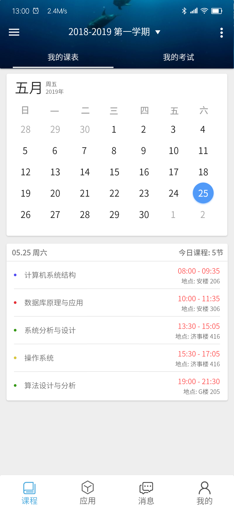
 
##### 应用
 

##### 消息
 
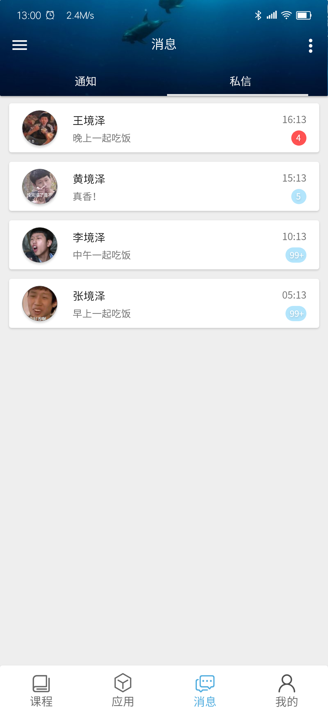

##### 我的（个人信息和设置）
 
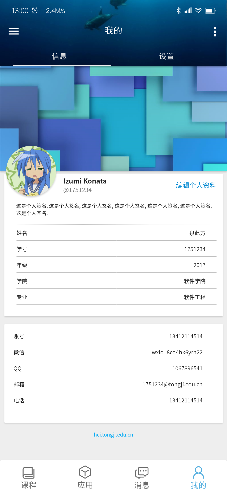

##### 侧边栏
 
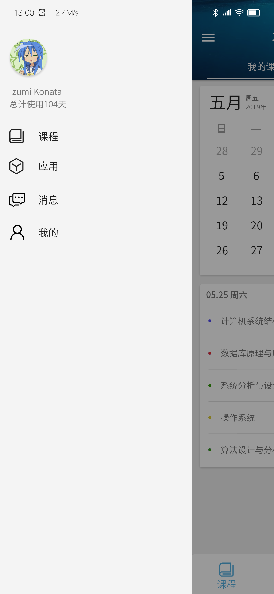
 
## 5. 评估

1. 人物角色、需求、功能基本符合实际，我们列举了相应角色在生活中的大部分校内常用操作，这些功能来自对日常生活的分析，具有实际性。
2. 原型界面也是我们所想要的效果，简单美观，暂时没有发现明显的问题。
3. 达到预期：基本达到预期。
